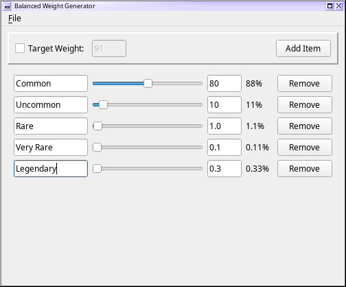

Balanced Items Generator
========================

This is a little Python 3 / PyQt5 application to assist in the creation
of Balanced Items / Weighted probability pools.  This was mainly created
to assist in editing Borderlands 2 / Pre-Sequel mods, since "weighted"
or balanced pools are used throughout Borderlands all over the place.
Figuring out the exact weights to use by hand is sometimes rather
annoying, so I wrote this to compensate.  See
[this blog post](http://www.gearboxsoftware.com/2013/09/inside-the-box-the-borderlands-2-loot-system/) or
[this wiki article](https://github.com/BLCM/BLCMods/wiki/Understanding-Borderlands-Weight-and-Probability-Values)
for more info about the context in which this came about.

The main point, really, is that next to the actual numerical weights (in a
text box, for easy copy+paste) is the actual percentage chances for each
line, which is generally what you're looking for when constructing these
as a human.

Note that this *does* have one major deficiency when it comes to Borderlands
modding, though: it doesn't take into account any of the constants or
dynamic variables which are available in the game.  For instance, you can't
plug in a "common" or "uncommon" weight and do anything useful with it.  It's
only really useful for getting raw balance/weight numbers.

Some of the behavior here may not be entirely intuitive, but hopefully a
minute or two of playing around should make things clear.  Note that the
individual weight textboxes are *not* editable when the balanced pool as a
whole is being locked to a specific weight target.  (This is there so that
you can adjust weights which must "fit in" to a larger pool, such as the
altering the weapon rates inside the Slot Machines, without altering the
chances of dropping a weapon in general.)

Requirements
------------

This is a Python 3 + PyQt5 application.  It's been developed entirely on
Linux, but it works just fine in Windows (and should in Mac as well) so long as
you've got the necessary stuff installed, though Linux folks will have the
easiest time of it.

**Linux:** You may already have these installed via your package manager,
but if not, just use your package manger to install a package named something
like `python-pyqt5` or `pyqt5` or the like, and that should take care of it
for you.

**Windows/Mac:**
1. Install the latest Python 3.x.x version from
  [python.org](https://www.python.org/downloads/).  The latest (as of April 8, 2022) is 3.10.4.
2. Be sure to check the option that says something like "Add Python.exe to path"
  or "Add Python to environment variables" when installing.
3. Hop out to a commandline/terminal/powershell and see if running the command
  `python -V` outputs something like `Python 3.10.4`.
4. If so, try just running `pip install PyQt5` or `pip3 install PyQt5`.  If that
  seemed to work, you may be good to go at that point!
5. Just double-click on `balanced.py` in an Explorer/Finder window, to launch
  it.

Usage
-----

Simply run `balanced.py` and it should do its thing.  If that's not
working, try running it from a commandline/terminal/console, to see if it's
printing out any error messages.

Bugs/TODO
---------

* It'd probably be nice to have it understand at least *some* of the Borderlands
  constants / `AttributeDefinition`s, `AttributeInitializationDefinition`s, etc.
* The app probably gives too much empty space to the right, when doing actions
  which re-scale the sliders.
* It'd be nice if the far-left side of the slider was more fine-tuned; use a
  logarithmic scale or something.
* It'd also be nice to be able to manually specify the bounds of the weights,
  when not being bound to a specific total weight value.  Manually entering a
  high number in the weight box, for instance, should probably auto-grow it.
* The code is a mess and nearly completely undocumented.  This was thrown together
  in an extremely ad-hoc fashion after I got sick of dealing with weights manually.
* Really this should be a plugin in [BLCMM](https://github.com/BLCM/BLCMods/wiki/Borderlands-Community-Mod-Manager),
  not a standalone application.

Changelog
---------

**April 8, 2022**
 - Added text labels for rows, courtesy apple1417
 - Updated with some fixes for newer Qt versions

**August 3, 2018**
 - Initial version

License
-------

This is licensed under the [3-clause BSD license](https://opensource.org/licenses/BSD-3-Clause).
See [COPYING.txt](COPYING.txt).
